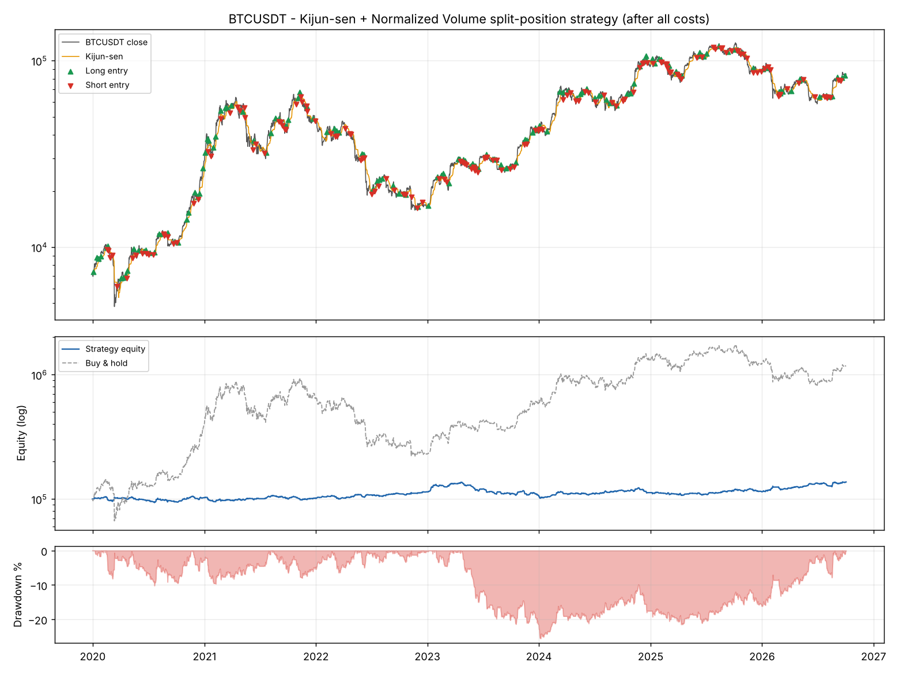
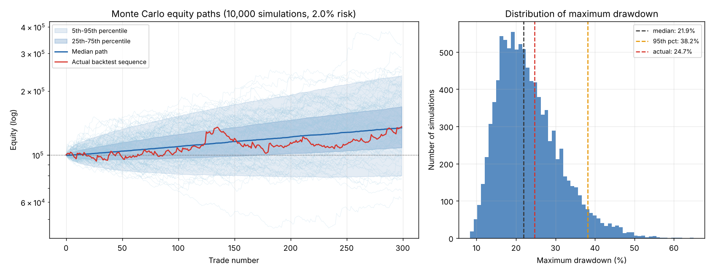
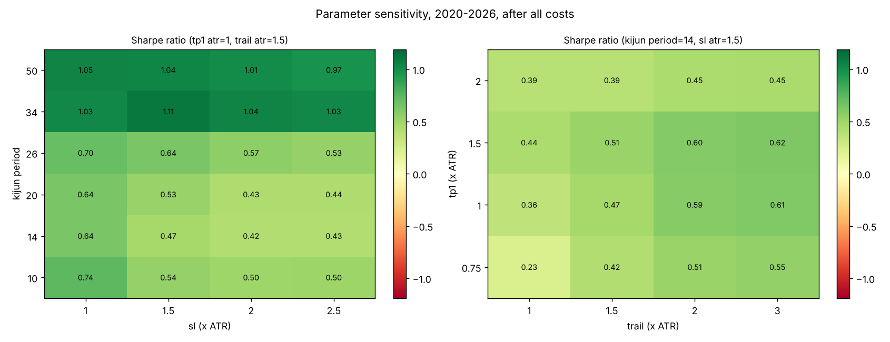
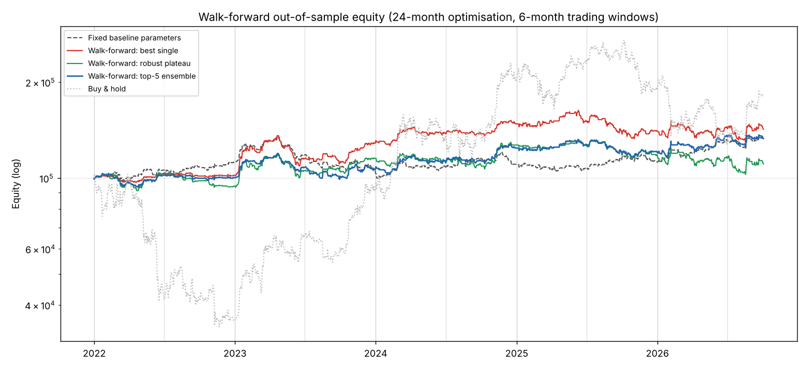

# Algorithmic Trading Backtest: Kijun-sen + Normalized Volume (Crypto)

An event-driven Python backtesting framework for a **split-position trend-following strategy** on Binance BTC/USDT. It covers:

- **Realistic execution:** maker/taker fees, slippage and spot-margin borrowing costs, with every fill simulated on **5-minute bars**.
- **Risk analysis:** Monte Carlo drawdown and risk-of-ruin analysis.
- **Parameter robustness:** a 384-combination sensitivity grid and **walk-forward optimisation**.

The strategy uses the Ichimoku **Kijun-sen** as the trend baseline and **Normalized Volume** as confirmation. It is a Python port of a MetaTrader 5 Expert Advisor I built.



---

## Table of contents
1. [Strategy logic](#1-strategy-logic)
2. [Position sizing and trade management](#2-position-sizing-and-trade-management)
3. [Execution and cost model](#3-execution-and-cost-model)
4. [Results](#4-results)
5. [Monte Carlo risk analysis](#5-monte-carlo-risk-analysis)
6. [Parameter robustness and walk-forward optimisation](#6-parameter-robustness-and-walk-forward-optimisation)
7. [Interpretation](#7-interpretation)
8. [Limitations](#8-limitations)
9. [Project structure and how to run](#9-project-structure-and-how-to-run)
10. [Changes from v1](#10-changes-from-v1)
11. [Next steps](#11-next-steps)

---

## 1. Strategy logic

### Indicators (daily bars)

| Indicator | Formula | Role |
|---|---|---|
| **Kijun-sen (14)** | (Highest high + Lowest low) / 2 over the last 14 bars | Trend baseline. Price above = bullish bias, below = bearish |
| **Normalized Volume (14)** | Volume / SMA(Volume, 14) × 100 | Confirmation. "Green" when > 100, meaning volume is above its own recent average |
| **ATR (14)** | Wilder's Average True Range | Sets stop-loss, take-profit and trailing distances |

### Entry rules

| Entry type | Condition | Direction |
|---|---|---|
| **Cross (primary)** | Price closes across the Kijun-sen, the candle closes in the direction of the cross, and volume is green | Direction of the cross |
| **Volume refresh (secondary)** | No fresh cross, but Normalized Volume turns from red to green while price stays on one side of the Kijun | Side of the Kijun price is on |
| **Reverse re-entry** | A reverse signal closes the open cycle, and the same bar also qualifies as a primary entry in the opposite direction | Opposite to the closed cycle |

Signals use the **last closed daily bar** and are executed from the **next day's open**, so there is no look-ahead.

---

## 2. Position sizing and trade management

Each signal opens a **cycle** made of **two equal legs**:

| | Leg 1 (the "banker") | Leg 2 (the "runner") |
|---|---|---|
| Stop-loss | 1.5 × ATR | 1.5 × ATR |
| Take-profit | 1.0 × ATR | None |
| Trailing stop | No | 1.5 × ATR from the previous close, updated at each new daily bar, only moves in the trade's favour |
| After leg 1's TP | Closed | Stop moves to **breakeven** |

- **Risk:** each cycle risks **2% of current equity** in total across both legs, measured at the initial stop. The Monte Carlo analysis in section 5 shows why 2% was chosen over 3%.
- **Linked exits:** if leg 2 is stopped out while leg 1 is still open, leg 1 is force-closed at the same moment. A **reverse signal** (a close on the other side of the Kijun-sen) closes both legs at the next open.
- **Leverage cap:** total position notional is capped at **3× equity**, Binance's cross-margin limit. In practice the largest position in the backtest was 0.72× equity.

---

## 3. Execution and cost model

Signals come from daily bars, but **every order is simulated on 5-minute bars** (710,318 bars, 100% coverage of the trading days). This also removes the classic daily-bar problem of not knowing whether the stop or the target was hit first within the day.

### Order types

| Order | Order type | Fee | Slippage | Fill logic |
|---|---|---|---|---|
| **Entry** | Limit at the daily open | Maker | None | Filled only if price **trades through** the limit within 60 minutes. Otherwise it is replaced by a market order (taker + slippage) |
| **Leg 1 take-profit** | Resting limit | Maker | None | Filled only if price trades **through** the level. A gap fills at the better open price |
| **Initial / trailing / breakeven stop** | Stop-market | Taker | Yes | First 5-minute bar touching the stop. A gap fills at that bar's open, then slippage is applied |
| **Reverse exit** | Market at the open | Taker | Yes | First 5-minute bar of the day |

### Costs (Binance spot margin account, regular user)

| Cost | Assumption | Source / rationale |
|---|---|---|
| Maker / taker fee | **0.075% / 0.075%** | VIP 0 is 0.10% / 0.10%. Paying fees in BNB gives a 25% discount |
| Slippage (market and stop orders) | **1 bp + 10% of the fill bar's high-low range** | Grows automatically in fast markets, where stops get hit |
| BTC borrow interest (shorts) | **0.012% per day (~4.4% a year)**, on the full short position | Typical published Binance margin rate. Charged per started hour |
| USDT borrow interest (longs) | **0.030% per day (~11% a year)**, only on notional above equity | Never triggered: longs were always fully funded by equity |

Within a single 5-minute bar, a stop is still assumed to fill before a target. That is conservative, but with 288 bars a day it rarely matters.

---

## 4. Results

**BTC/USDT · 1 Jan 2020 → 3 Oct 2026 (6.76 years) · 100,000 USDT start · 2% risk per cycle · all costs included**

### 4.1 Headline KPIs vs. buy & hold

| KPI | Strategy | Buy & Hold BTC |
|---|---:|---:|
| Final equity | **137,158** | 1,176,990 |
| Total return | **+37.2%** | +1,077.0% |
| CAGR | **+4.8%** | +44.1% |
| Max drawdown | **−25.6%** | −76.6% |
| Sharpe ratio (annualised, rf = 0) | **0.47** | 0.91 |
| Sortino ratio | **0.64** | n/a |
| Calmar ratio (CAGR / Max DD) | **0.19** | 0.58 |
| Recovery factor (Net profit / Max DD $) | **1.06** | n/a |
| Time in market | **75.4%** | 100% |

### 4.2 Trade statistics

| KPI | Value | What it means |
|---|---:|---|
| Total cycles | 300 (139 W / 161 L) | ~44 trades per year |
| Win rate | 46.3% | Fewer than half the cycles are profitable… |
| Payoff ratio (avg win / avg loss) | 1.36 | …but winners are 36% larger than losers |
| **Profit factor** | **1.18** | Gross profit / gross loss after all costs. A positive but thin edge |
| Expectancy | +123.9 USDT per cycle (+0.12% of equity) | Average net result per trade |
| Average win / average loss | +1,784 / −1,309 | |
| Largest win / largest loss | +14,387 / −2,754 | The runner leg captures outliers, while the ATR stop caps losses |
| Max winning / losing streak | 6 / 7 cycles | |
| Average holding period | 6.2 days | |
| Entries filled as maker | 99.0% | The limit at the open is almost always traded through within an hour |

### 4.3 Where the costs go

| | USDT | % of gross P&L |
|---|---:|---:|
| Gross P&L before costs | **64,273** | 100% |
| − Exchange fees | 17,380 | 27.0% |
| − Slippage | 6,957 | 10.8% |
| − Margin interest (all on shorts) | 2,779 | 4.3% |
| **= Net P&L** | **37,158** | **57.8%** |

### 4.4 Cost scenarios: how much each assumption matters

| Scenario | Return | CAGR | Sharpe | Max DD | PF | Total costs |
|---|---:|---:|---:|---:|---:|---:|
| No costs (daily bars) | +69.4% | +8.1% | 0.75 | −22.1% | 1.31 | 0 |
| Fees only (0.10%), daily bars (≈ v1 model) | +38.1% | +4.9% | 0.48 | −25.0% | 1.18 | 23,599 |
| Base-case costs, daily bars only | +40.1% | +5.1% | 0.50 | −24.8% | 1.19 | 22,594 |
| VIP 0 without BNB (0.10% fees), all costs | +30.3% | +4.0% | 0.40 | −26.3% | 1.14 | 32,093 |
| **Base case: 0.075% fees, all costs, intraday** | **+37.2%** | **+4.8%** | **0.47** | **−25.6%** | **1.18** | **27,116** |
| Base case with market-order entries | +39.3% | +5.0% | 0.49 | −25.8% | 1.18 | 31,937 |
| Base case, 2× slippage and 2× borrow rates | +25.5% | +3.4% | 0.35 | −26.8% | 1.12 | 35,081 |

### 4.5 Long vs. short, and entry types

| Side | Cycles | Net P&L | Win rate |
|---|---:|---:|---:|
| Long | 153 | **+55,212** | 51% |
| Short | 147 | **−18,054** | 41% |

| Entry type | Cycles | Net P&L | Win rate |
|---|---:|---:|---:|
| Cross (primary) | 114 | +542 | 43% |
| Volume refresh (secondary) | 123 | +16,048 | 53% |
| Reverse re-entry | 63 | +20,568 | 40% |

### 4.6 Where the P&L comes from (by exit, leg level)

| Exit | Legs | P&L |
|---|---:|---:|
| Leg 1 take-profit | 139 | **+99,728** |
| Leg 2 trailing / breakeven stop | 143 | **+106,480** |
| Reverse-signal close | 243 | **−81,057** |
| Initial stop (both legs) | 54 | −62,508 |
| Leg 1 forced close (alongside leg 2's trailing stop) | 20 | −17,310 |

*Leg-level P&L is after exit fees, slippage and interest, but before entry fees.*

### 4.7 Year by year

| Year | Strategy | Buy & Hold | Max DD within year | Cycles |
|---|---:|---:|---:|---:|
| 2020 | +2.5% | +302.0% | −10.2% | 46 |
| 2021 | −0.6% | +59.8% | −8.0% | 43 |
| **2022** | **+12.2%** | **−64.2%** | −6.2% | 35 |
| 2023 | −6.3% | +155.6% | −21.6% | 52 |
| 2024 | +5.1% | +121.3% | −9.1% | 44 |
| 2025 | +1.7% | −6.3% | −5.6% | 47 |
| 2026 (to 3 Oct) | +19.9% | −3.3% | −6.8% | 33 |

### 4.8 Same parameters on other assets (1 Jan 2024 → Oct 2026, daily-bar fills, base-case costs)

| Asset | Return | Max DD | Sharpe | Profit factor | Buy & Hold | Buy & Hold Max DD |
|---|---:|---:|---:|---:|---:|---:|
| BTC/USDT | +26.0% | −16.1% | 0.83 | 1.37 | +92.1% | −53.0% |
| SOL/USDT | +4.0% | −9.2% | 0.19 | 1.06 | +7.7% | −76.3% |
| BNB/USDT | −0.8% | −15.0% | 0.02 | 0.99 | +146.2% | −58.2% |
| ETH/USDT | −10.8% | −21.3% | −0.31 | 0.88 | +15.1% | −67.6% |

---

## 5. Monte Carlo risk analysis

The backtest shows **one** historical ordering of 299 closed trades. A different ordering of the same kind of trades could produce a very different drawdown. A single backtest drawdown is therefore a poor estimate of the risk you would actually face.

### Method
1. Take each closed cycle's net return as a **% of equity at entry** (after all costs).
2. **Bootstrap:** draw 299 trades at random *with replacement* to build a synthetic trade history, compounding equity trade by trade.
3. Repeat **10,000 times** (fixed seed, so it's reproducible) and record each path's final return, maximum drawdown and longest losing streak.
4. **Risk of ruin** is the probability that equity ever falls **50% below its running peak**.
5. Repeat with returns rescaled to **1–5% risk per trade** to see how position sizing drives ruin risk.



### Results at 2% risk per cycle

| Metric | 5th pct | Median | 95th pct | Actual backtest |
|---|---:|---:|---:|---:|
| Final return | −20.1% | +34.2% | +136.3% | +35.8% |
| CAGR | −3.3% | +4.4% | +13.6% | n/a |
| Max drawdown (trade-to-trade) | n/a | 21.9% | **38.2%** | 24.7% |
| Longest losing streak | n/a | 8 | 12 | 7 |

| Risk measure | Value |
|---|---:|
| Probability of finishing at a loss | **17.7%** |
| P(max drawdown ≥ 20%) | 60.8% |
| P(max drawdown ≥ 30%) | 18.2% |
| P(max drawdown ≥ 40%) | 3.7% |
| **Risk of ruin (drawdown ≥ 50%)** | **0.39%** |
| 99th percentile / worst drawdown | 46.5% / 65.0% |

### Risk-per-trade sensitivity

| Risk per cycle | Median return | Median max DD | 95th pct max DD | P(loss) | Risk of ruin |
|---:|---:|---:|---:|---:|---:|
| 1% | +17.4% | 11.4% | 21.0% | 15.9% | **0.0%** |
| **2% (base)** | **+34.2%** | **21.9%** | **38.2%** | **17.7%** | **0.4%** |
| 3% | +49.5% | 31.5% | 52.2% | 19.5% | **6.8%** |
| 4% | +62.2% | 40.2% | 63.4% | 21.6% | **23.4%** |
| 5% | +71.8% | 48.1% | 72.4% | 24.2% | **44.7%** |

**Takeaways:**
- The historical 24.7% drawdown sits around the **63rd percentile**: typical, not unlucky. Plan for ~22% and size for ~38% (the 95th percentile).
- **2% risk** keeps ruin risk below 0.5%. At 3% it jumps to ~7%, and at 5% it approaches 45%. Higher risk adds return far more slowly than it adds ruin risk (volatility drag).
- Roughly **1 in 6 sequences ends at a loss**. The edge is real but small relative to trade-to-trade noise.

> Bootstrapping assumes trades are independent. Real losses cluster in choppy regimes (e.g. 2023), so the true drawdown tail is probably somewhat fatter than shown.

---

## 6. Parameter robustness and walk-forward optimisation

Any single parameter set (Kijun 14, SL 1.5, TP 1.0, Trail 1.5) might just be lucky, and simply picking the best set over the full history is curve-fitting. Two tests address this:

### 6.1 Sensitivity grid: is the edge a parameter fluke?

All **384 combinations** of Kijun period {10, 14, 20, 26, 34, 50} × stop {1.0, 1.5, 2.0, 2.5} × TP1 {0.75, 1.0, 1.5, 2.0} × trail {1.0, 1.5, 2.0, 3.0} ATR were backtested with the full cost model.



| Finding | Value |
|---|---:|
| Parameter sets with a positive return after costs | **384 / 384 (100%)** |
| Parameter sets with Sharpe > 0.5 | 67% |
| Median Sharpe / median return across all sets | 0.59 / +46.3% |
| Baseline (Kijun 14) Sharpe and rank | 0.47, rank 277 of 384 |
| Best full-period set (in-sample, optimistic) | Kijun 34, SL 2.5, TP 1.0, Trail 3.0: Sharpe 1.19, max DD −8.3% |

**Median Sharpe by parameter value** (each value is averaged across all other parameters):

| Kijun | 10 | 14 | 20 | 26 | **34** | **50** |
|---|---:|---:|---:|---:|---:|---:|
| Median Sharpe | 0.58 | 0.48 | 0.43 | 0.49 | **0.94** | **0.85** |

| Trail (× ATR) | 1.0 | 1.5 | 2.0 | **3.0** |
|---|---:|---:|---:|---:|
| Median Sharpe | 0.44 | 0.55 | 0.63 | **0.66** |

The result is a **broad plateau, not a spike**. Every combination is profitable, and slower baselines (Kijun 34–50) with wider trailing stops are consistently better. That fits the diagnosis in section 7: a fast Kijun gets whipsawed by reverse signals.

### 6.2 Walk-forward optimisation: does optimising actually help on unseen data?

**Method:** optimise on **24 months**, then trade the **next 6 months** with the chosen parameters on data the optimiser never saw. Roll forward 6 months and repeat. That gives 10 out-of-sample windows from Jan 2022 to Oct 2026, stitched into one equity curve. The selection metric is in-sample Sharpe, with a minimum of 20 trades. Three selection rules were compared:

- **Best single:** the highest in-sample Sharpe.
- **Robust plateau:** the highest *average* Sharpe of a set and all its grid neighbours, which avoids isolated spikes.
- **Top-5 ensemble:** capital split equally across the 5 best sets, so **multiple parameter sets trade at once**.



| Out-of-sample, Jan 2022 → Oct 2026 | Return | CAGR | Sharpe | Max DD | Calmar |
|---|---:|---:|---:|---:|---:|
| Fixed baseline parameters (no optimisation) | +34.7% | +6.5% | 0.62 | −25.6% | 0.25 |
| Walk-forward: best single | **+42.3%** | **+7.7%** | **0.63** | −20.3% | **0.38** |
| Walk-forward: robust plateau | +10.8% | +2.2% | 0.23 | −22.2% | 0.10 |
| **Walk-forward: top-5 ensemble** | +33.0% | +6.2% | 0.60 | **−16.3%** | **0.38** |
| Buy & hold BTC | +83.4% | +13.6% | 0.50 | −66.9% | 0.20 |

**Overfitting check:** the "best" parameters averaged an **in-sample Sharpe of 1.61** but only **0.68 out-of-sample**, a ~58% decay. Every window's chosen parameters and results are in `results/walk_forward_windows.csv`.

---

## 7. Interpretation

**1. A real edge that survives realistic costs, but a thin one.** After fees, slippage and borrowing costs, the profit factor is 1.18 and expectancy +0.12% per trade over 300 trades. All 384 parameter combinations are profitable, so the edge is not a parameter fluke. Its size is modest, though.

**2. Execution costs consume 42% of the gross edge.** Fees are the biggest item (27% of gross P&L), followed by slippage (11%) and margin interest (4%). Moving from VIP 0 without BNB to paying in BNB adds ~7 percentage points of return. Doubling slippage and borrow rates removes ~12. For a ~44-trades-a-year system, **execution quality matters as much as the signal.**

**3. Maker entries don't pay at the retail fee tier.** Limit entries filled 99% of the time, yet **market entries returned slightly more** (+39.3% vs +37.2%). At VIP 0, maker and taker fees are identical, so a limit order saves nothing on fees. It does suffer **adverse selection**: it fills exactly when price moves against you, and misses trades that run away. Maker execution only becomes worthwhile at VIP tiers where maker fees are below taker fees.

**4. Daily-bar backtests flatter this strategy slightly.** With the same costs, daily-bar fills return +40.1% and intraday fills +37.2%. On daily bars a stop fills exactly at its level. On 5-minute bars, stops are hit during fast moves and pay realistic slippage.

**5. It's a risk-reducer, not a return-maximiser.** The strategy lags buy & hold BTC on return (+37% vs +1,077%), but with **a third of the drawdown** (−25.6% vs −76.6%). It made **+12.2% in 2022** while BTC fell 64%. It fits as a **diversifying, crisis-alpha sleeve**, not a replacement for a long BTC position.

**6. The main leak is the Kijun reverse exit in choppy markets.** Reverse-signal closes cost −81k, more than the initial stops (−63k). 2023 is the clearest example: a choppy, rising market produced 52 trades and the deepest drawdown (−21.6%). The sensitivity grid confirms this independently. Slower Kijun periods (34–50) flip less often and nearly double the median Sharpe.

**7. Shorts still lose money, and pay to borrow.** Longs made +55k and shorts lost −18k, including all 2.8k of margin interest. Shorting an asset with a strong long-term upward drift is a structural headwind, although shorts helped in 2022.

**8. Optimisation overfits. Diversifying across parameters is what helps.** In-sample Sharpe fell from 1.61 to 0.68 out-of-sample. The re-optimised "best single" set reached a similar out-of-sample Sharpe to simply keeping the fixed parameters (0.63 vs 0.62). It beat the baseline in only 5 of 10 windows, and its higher return comes mostly from a single window (2023 H2: +11.8% vs −10.9%). The "robust plateau" rule did worst, because the regions that looked stable in-sample (Kijun 50 with tight targets) were not the ones that worked next. The **top-5 ensemble** matched the baseline's Sharpe while cutting the max drawdown from 25.6% to **16.3%**. Spreading capital across several good parameter sets is a more reliable way to handle parameter uncertainty than trying to find the single best one.

**9. Sizing: 2% risk per trade.** The Monte Carlo analysis puts the risk of a 50% drawdown at 0.4% at 2% risk, versus ~7% at 3% and ~45% at 5%.

**Bottom line:** after realistic costs, intraday execution and out-of-sample testing, the strategy keeps a **small, robust, positive edge on BTC**, with strong drawdown protection versus buy & hold. Before it could be considered for live capital, it would need:
- lower execution costs (a higher VIP tier, so that maker orders actually save fees)
- a filter for ranging markets, or slower baselines
- trading a **parameter ensemble** at **≈2% risk** rather than one "optimal" set

---

## 8. Limitations

- **Slippage is modelled, not measured.** There is no historical order-book depth, so slippage is a volatility-based model. Maker fills require price to trade through the level, but queue position is not simulated.
- **Borrow rates are fixed.** Binance margin rates are dynamic and can spike in stress periods, and borrow availability is assumed.
- **Within a 5-minute bar**, a stop is still assumed to hit before a target (conservative).
- **Walk-forward evaluation** slices full-period runs, so a trade that spans a window boundary is split across windows. The parameter grid is limited to 4 dimensions (volume settings fixed).
- **Monte Carlo** assumes independent trades, so regime clustering makes the real tail fatter.
- **Single asset with intraday fills.** The other assets were tested on daily bars only, and only large-cap, surviving coins were tested (survivorship).
- Past performance does not guarantee future results. This is a research project, not investment advice.

---

## 9. Project structure and how to run

```
python-algo-trading-backtest/
├── backtester/
│   ├── config.py         # all settings: market, strategy params, cost model, Monte Carlo, optimisation grid
│   ├── data.py           # Binance REST download + local CSV cache + per-day intraday book
│   ├── engine.py         # event-driven engine: daily signals, 5-minute execution, fees, slippage, interest
│   ├── metrics.py        # KPIs and console report
│   ├── monte_carlo.py    # bootstrap simulation, drawdown distribution, risk of ruin
│   ├── optimize.py       # parameter grid + walk-forward optimisation
│   └── plots.py          # static PNG charts + interactive Plotly chart
├── results/              # charts and CSV outputs (used in this README)
├── requirements.txt
├── run_backtest.py       # backtest + cost scenarios + Monte Carlo
└── run_optimization.py   # sensitivity grid + walk-forward (~1 minute)
 
```

```bash
git clone https://github.com/AliAgha-Analytics/python-algo-trading-backtest.git
cd python-algorithmic-trading-backtest
pip install -r requirements.txt
python run_backtest.py
python run_optimization.py
```

The first run downloads ~710k five-minute candles from Binance's public API, which takes about 5–10 minutes. After that the data is cached locally in `data_cache/`. All settings are in `backtester/config.py`.

| Output (`results/`) | Content |
|---|---|
| `results.png` | Price, entries, equity vs buy & hold, drawdown |
| `monte_carlo.png` | Monte Carlo fan chart and drawdown distribution |
| `parameter_heatmap.png` | Sharpe ratio heatmaps across parameter pairs |
| `walk_forward.png` | Out-of-sample equity of the walk-forward variants |
| `cycles.csv` | One row per trade: entry, side, size, maker/taker, gross P&L, fees, slippage, interest, net P&L |
| `parameter_grid.csv` | KPIs for all 384 parameter sets |
| `walk_forward_windows.csv` / `walk_forward_summary.csv` | Chosen parameters and results per window, and overall |
| `chart.html` | Interactive chart (generated locally, not committed) |

---

## 10. Next steps

- [ ] **Regime filter** (e.g. ADX or 200-day MA) to avoid whipsaw reverse exits in ranging markets
- [ ] **Block bootstrap** Monte Carlo to capture loss clustering
- [ ] **Order-book-based slippage** using historical depth snapshots
- [ ] **Multi-asset portfolio** with volatility-based allocation

---

**Tools:** Python · pandas · NumPy · Matplotlib · Plotly · Binance REST API
**Author:** Ali Agha · [LinkedIn](https://www.linkedin.com/in/ali-agha-a068551b5) · [GitHub](https://github.com/AliAgha-Analytics)
