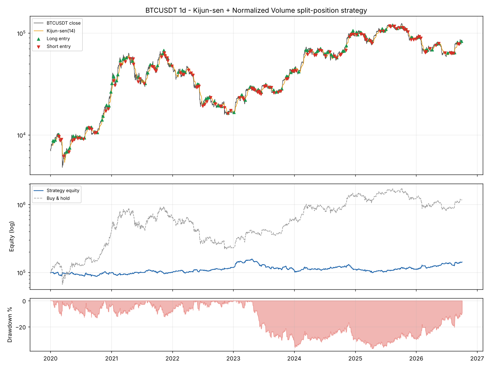

# Kijun-sen + Normalized Volume Strategy Backtest (Crypto)

An event-driven Python backtest of a **split-position trend-following strategy** on Binance BTC/USDT daily data.
The strategy uses the Ichimoku **Kijun-sen** as the trend baseline and **Normalized Volume** as confirmation.

It is a Python port of a MetaTrader 5 Expert Advisor I built. The rules, position management and edge cases match the EA one-to-one. I then added crypto exchange fees, risk-based sizing and a full KPI report on top.



---

## Table of contents
1. [Strategy logic](#1-strategy-logic)
2. [Position sizing and trade management](#2-position-sizing-and-trade-management)
3. [Backtest engine and assumptions](#3-backtest-engine-and-assumptions)
4. [Results](#4-results)
5. [Interpretation](#5-interpretation)
6. [Limitations](#6-limitations)
7. [How to run](#7-how-to-run)
8. [Next steps](#8-next-steps)

---

## 1. Strategy logic

### Indicators

| Indicator | Formula | Role |
|---|---|---|
| **Kijun-sen (14)** | (Highest high + Lowest low) / 2 over the last 14 bars | Trend baseline. Price above = bullish bias, below = bearish |
| **Normalized Volume (14)** | Volume / SMA(Volume, 14) × 100 | Confirmation. "Green" when > 100, meaning volume is above its own recent average |
| **ATR (14)** | Wilder's Average True Range | Sets stop-loss, take-profit and trailing distances |

### Entry rules

| Entry type | Condition | Direction |
|---|---|---|
| **Cross (primary)** | Price closes across the Kijun-sen, the candle closes in the direction of the cross, and volume is green | Direction of the cross |
| **Volume refresh (secondary)** | No fresh cross, but Normalized Volume turns from red to green while price stays on one side of the Kijun | Side of the Kijun price is on |
| **Reverse re-entry** | An open cycle is closed by a reverse signal, and that same bar also qualifies as a primary entry in the opposite direction | Opposite to the closed cycle |

All signals use the **last closed bar** and are executed at the **next bar's open**, so there is no look-ahead.

---

## 2. Position sizing and trade management

Each signal opens a **cycle** made of **two equal legs**:

| | Leg 1 (the "banker") | Leg 2 (the "runner") |
|---|---|---|
| Stop-loss | 1.5 × ATR | 1.5 × ATR |
| Take-profit | 1.0 × ATR | None |
| Trailing stop | No | 1.5 × ATR from the previous close, updated once per bar, only moves in the trade's favour |
| After leg 1's TP | Closed | Stop moves to **breakeven** |

**Sizing.** Each cycle risks **3% of current equity** in total across both legs, measured at the initial stop distance. Equity compounds.

**Linked exits:**
- If leg 2 is stopped out while leg 1 is still open, leg 1 is **force-closed** at the same price. A cycle always resolves as one event.
- If price closes on the **opposite side of the Kijun-sen**, both legs are closed at the next open (a reverse signal).

The point of this design is to take a quick, high-probability profit on half the position and lock in a risk-free trade. The other half is left to capture an extended trend.

---

## 3. Backtest engine and assumptions

| Item | Setting |
|---|---|
| Market | Binance spot **BTC/USDT**, daily candles |
| Period | **1 Jan 2020 → 3 Oct 2026** (6.75 years, 2,468 bars) |
| Starting capital | 100,000 USDT |
| Fees | **0.10% per side** (Binance taker), charged on every leg's entry and exit |
| Data | Binance public REST API, cached locally as CSV |

Fill model (conservative by design):
- Signals are decided on the bar's close and executed at the next bar's open.
- Within a bar, the **adverse extreme is assumed to happen before the favourable one**. Stops are checked before take-profits.
- If price **gaps through** a stop or target, the fill is the bar's open, not the level.
- The engine is **event-driven** (bar-by-bar loop), not vectorised. This is needed to model the two legs, the trailing stop and the linked exits correctly.

---

## 4. Results

### 4.1 Headline KPIs: strategy vs. buy & hold (2020 → Oct 2026)

| KPI | Strategy | Buy & Hold BTC |
|---|---:|---:|
| Final equity | **142,455** | 1,176,990 |
| Total return | **+42.5%** | +1,077.0% |
| CAGR | **+5.4%** | +44.1% |
| Max drawdown | **−36.9%** | −76.6% |
| Sharpe ratio (annualised, rf = 0) | **0.39** | 0.91 |
| Sortino ratio | **0.53** | n/a |
| Calmar ratio (CAGR / Max DD) | **0.15** | 0.58 |
| Recovery factor (Net profit / Max DD $) | **0.73** | n/a |
| Time in market | **72.8%** | 100% |

### 4.2 Trade statistics

| KPI | Value | What it means |
|---|---:|---|
| Total cycles | 295 (134 W / 161 L) | ~44 trades per year |
| Win rate | 45.4% | Fewer than half the cycles are profitable… |
| Payoff ratio (avg win / avg loss) | 1.36 | …but winners are 36% larger than losers |
| **Profit factor** | **1.13** | Gross profit / gross loss. Above 1 means a positive edge, but a thin one |
| Expectancy | +143.9 USDT per cycle (+0.16% of equity) | Average net result per trade |
| Average win / average loss | +2,700 / −1,984 | |
| Largest win / largest loss | +23,599 / −4,716 | The trailing leg captures outliers. Losses stay capped by the ATR stop |
| Max winning / losing streak | 5 / 8 cycles | 8 losses in a row at 3% risk ≈ 22% drawdown, a realistic worst case to plan for |
| Average holding period | 6.1 days | |
| Total fees paid | 34,410 USDT (34.4% of starting capital) | |

### 4.3 Long vs. short

| Side | Cycles | Net P&L | Win rate |
|---|---:|---:|---:|
| Long | 150 | **+68,930** | 48% |
| Short | 145 | **−26,475** | 43% |

### 4.4 Year-by-year

| Year | Strategy | Buy & Hold | Max DD within year | Cycles |
|---|---:|---:|---:|---:|
| 2020 | −1.2% | +301.7% | −13.2% | 44 |
| 2021 | +2.2% | +59.8% | −12.5% | 42 |
| **2022** | **+17.8%** | **−64.2%** | −9.4% | 35 |
| 2023 | −8.1% | +155.6% | −30.7% | 51 |
| 2024 | +1.8% | +121.3% | −16.1% | 44 |
| 2025 | −0.6% | −6.3% | −11.6% | 47 |
| 2026 (to 3 Oct) | +28.7% | −3.3% | −10.6% | 32 |

### 4.5 Where the P&L comes from

**By exit type** (leg-level P&L, after exit fees, before entry fees):

| Exit | Count | P&L |
|---|---:|---:|
| Leg 1 take-profit | 134 | **+144,298** |
| Leg 2 trailing / breakeven stop | 160 | **+91,113** |
| Reverse-signal close | 251 | **−104,526** |
| Leg 1 initial stop-loss | 37 | −64,810 |
| Forced close (leg 1 with leg 2) | 7 | −7,214 |

**By entry type** (net cycle P&L):

| Entry | Cycles | Net P&L | Win rate |
|---|---:|---:|---:|
| Cross (primary) | 109 | +1,193 | 41% |
| Volume refresh (secondary) | 119 | +15,647 | 52% |
| Reverse re-entry | 67 | +25,616 | 40% |

### 4.6 Robustness checks

**Fee sensitivity (BTC, 2020 → 2026):**

| Fee per side | Total return | CAGR | Sharpe | Max DD | Profit factor |
|---|---:|---:|---:|---:|---:|
| 0.00% | +93.2% | 10.2% | 0.66 | −32.0% | 1.27 |
| 0.05% | +65.9% | 7.8% | 0.53 | −33.9% | 1.20 |
| **0.10% (base case)** | **+42.5%** | **5.4%** | **0.39** | **−36.9%** | **1.13** |

**Same parameters on other assets (1 Jan 2024 → Oct 2026):**

| Asset | Return | Max DD | Sharpe | Profit factor | Buy & Hold return | Buy & Hold Max DD |
|---|---:|---:|---:|---:|---:|---:|
| BTC/USDT | +33.4% | −24.1% | 0.73 | 1.32 | +91.8% | −53.0% |
| SOL/USDT | +14.9% | −11.8% | 0.41 | 1.15 | +7.7% | −76.3% |
| BNB/USDT | −1.7% | −21.9% | 0.04 | 0.99 | +146.2% | −58.2% |
| ETH/USDT | −19.8% | −33.3% | −0.38 | 0.85 | +15.1% | −67.6% |

---

## 5. Interpretation

**1. There is an edge, but it is thin.** A profit factor of 1.13 and expectancy of +0.16% per trade are positive over 295 trades. The margin of safety is small, though. The strategy wins less than half the time and relies on a payoff ratio of 1.36 to come out ahead. That is the classic trend-following profile.

**2. Fees are the single biggest cost.** The strategy paid **34.4k USDT in fees** against **42.5k of net profit**, so fees ate roughly **45% of the gross edge**. Removing fees more than doubles the return (+93%) and lifts the profit factor to 1.27. With ~44 two-leg trades a year on daily bars, execution cost matters more than any parameter tweak. In practice this argues for maker (limit) orders, a VIP fee tier, or fewer and higher-conviction trades.

**3. It does not beat buy & hold BTC on return, and it isn't designed to.** BTC rose ~11x over the period. Any strategy that is flat or short ~27% of the time and risks 3% per trade will lag that. The fairer comparison is risk:
- Max drawdown is **less than half** of buy & hold (−36.9% vs −76.6%).
- In the **2022 bear market** the strategy made **+17.8%** while BTC lost **−64.2%**. In 2026 YTD it is up **+28.7%** while BTC is down.

This is the profile of a **diversifier or crisis-alpha sleeve**, not a replacement for a long BTC position. Its returns are lowly correlated with the underlying in exactly the periods when that matters most.

**4. The split-position design works as intended.** The two profit engines are leg 1's quick ATR target (+144k) and leg 2's trailing runner (+91k). The runner produced the largest single win (+23.6k) while the largest loss was capped at −4.7k. Moving to breakeven after TP1 turns many cycles into risk-free trades.

**5. The main leak is the Kijun-sen reverse exit in choppy markets.** Reverse-signal closes cost **−104.5k**, more than the initial stop-losses. A 14-period Kijun flips often when the market ranges. Each flip closes a position, often at a small loss, and frequently re-enters the other way. 2023 is the clearest example: BTC ground higher in a choppy range, the strategy took 51 trades, and it suffered its deepest drawdown (−30.7% within the year).

**6. Shorts lose money over the full sample.** Longs made +68.9k and shorts lost −26.5k. Shorting an asset with a strong long-term upward drift is a headwind. Shorts did help in 2022, though, so removing them entirely would trade bear-market protection for higher returns. A regime filter is the better fix (see Next steps).

**7. The parameters don't generalise well across assets.** The setup works on BTC and SOL but not on ETH or BNB with identical parameters. Together with the 2025–26 window looking much better (+27.7%, Sharpe 0.95) than 2023–24, this is a warning against cherry-picking a period. Any optimisation should be validated **out-of-sample** with walk-forward testing.

**Bottom line:** the strategy has a small, positive, fee-sensitive edge on BTC. It offers meaningful drawdown protection and bear-market performance, but it would need lower execution costs and a filter for ranging markets before it could be considered for live capital.

---

## 6. Limitations

- **Daily bars only.** The intra-bar order of high and low is unknown, so the engine assumes the worst case (stop before target). That may understate performance slightly.
- **No slippage or funding modelled** beyond the taker fee. Spot BTC/USDT is very liquid, but perpetual futures would add funding rate costs.
- **Shorting spot** assumes borrow is available at no cost. Realistically, the short side would run on perpetual futures.
- **Single parameter set**, no optimisation. That avoids overfitting, but the parameters are not proven optimal either.
- **Survivorship.** Tested on large-cap, surviving assets only.
- Past performance does not guarantee future results. This is a research project, not investment advice.

---

## 7. How to run

```bash
git clone https://github.com/AliAgha-Analytics/python-algo-trading-backtest.git
cd python-algo-trading-backtest
pip install -r requirements.txt
python kijun_volume_backtest.py
```

All parameters are in the `CONFIG` block at the top of the script: symbol, timeframe, dates, risk %, ATR multiples, indicator periods and fees. Set `END_DATE = None` to run up to the latest candle.

**Outputs:**

| File | Content |
|---|---|
| Console | Full KPI report, including the buy & hold benchmark |
| `cycles_<SYMBOL>_<TF>.csv` | One row per trade cycle: entry, side, size, fees, net P&L, holding time, exit reason |
| `events_<SYMBOL>_<TF>.csv` | Every individual entry and leg exit |
| `chart_<SYMBOL>_<TF>.html` | Interactive Plotly chart: candles, Kijun-sen, entry/exit markers, Normalized Volume and equity curve |
| `results_<SYMBOL>_<TF>.png` | Static summary chart (used in this README) |

---

## 8. Next steps

- [ ] **Regime filter**: only take longs above the 200-day MA and shorts below it, or skip trades when ADX < 20, to cut whipsaw reverse exits.
- [ ] **Walk-forward optimisation** of Kijun, ATR and volume parameters with out-of-sample validation.
- [ ] **Monte Carlo resampling** of the trade sequence to estimate the distribution of drawdowns and the risk of ruin.
- [ ] **Maker-fee execution** and slippage modelling on intraday data.
- [ ] **Perpetual futures version** including funding rates.
- [ ] **Portfolio test** across several assets with volatility-based allocation.

---

**Tools:** Python · pandas · NumPy · Plotly · Matplotlib · Binance REST API
**Author:** Ali Agha · [LinkedIn](https://www.linkedin.com/in/ali-agha-a068551b5) · [GitHub](https://github.com/AliAgha-Analytics)
